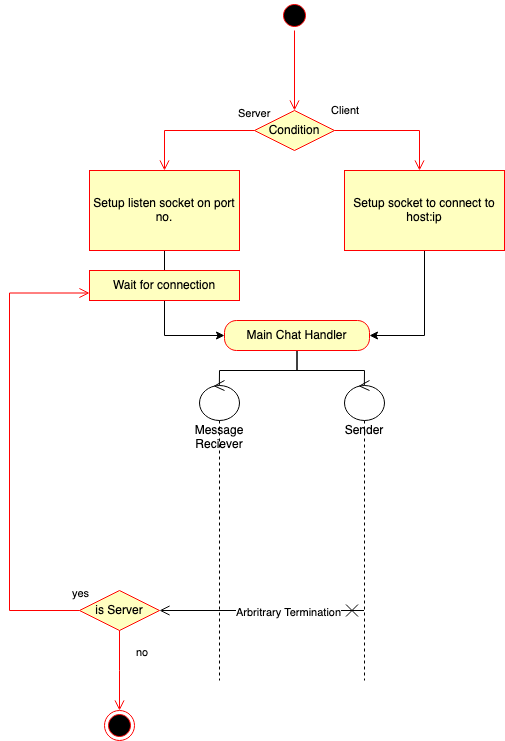

# chat
CLI Chat Application in OCaml

# TODO
- [x] Messaging Logic
- [x] RTT timings
- [x] CLI Parsing
- [x] Setup dependencies and build instructions
- [x] Safe termination
- [ ] Add logging flags to print out info, debug levels
- [ ] Tests

# Build & Running
```bash
# Install switch and dependencies
make switch
# Run server with default port 9000
make server
# Run client to connect to default server
make client
```
- [CTRL-D] terminate connection from either side, Client will exit but the server will continue to wait for new connections
- [CTRL-C] Terminate the server entirely

``` bash
# To pull up the CLI interface
dune exec -- chat --help
# Run server
dune exec -- chat listen [PORT]
# Run client
dune exec -- chat server [HOST] [PORT]
```

# Structure
```
.
├── Makefile
├── README.md
├── bin
│   ├── cli.ml
│   ├── dune
│   └── main.ml
├── chat.opam
├── dune-project
├── lib
│   ├── client.ml
│   ├── dune
│   ├── handlers.ml
│   ├── serializer.ml
│   ├── server.ml
│   └── sockUtil.ml
└── resources
    └── chat.png
```

## Conventions
- `sockUtil.ml` : Socket utilities
- `client.ml` & `server.ml` : Client & Server specific connecting and listening logic. Opens and Closes sockets and calls handlers. 
- `handlers.ml` : Connection handlers
- `serializer.ml` : Data formatting for sent and recieved data

# Pipeline
